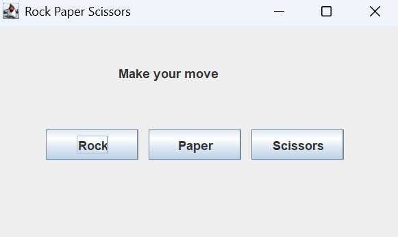

# Rock–Paper–Scissors Game (Java Swing)

A desktop-based Rock–Paper–Scissors game developed using **Java Swing**.  
The application provides an interactive graphical user interface where users can play against the computer and view results instantly.

## 🛠 Technologies Used
- Java
- Java Swing
- Object-Oriented Programming (OOP)

## ✨ Features
- User-friendly graphical interface
- Real-time game result display
- Random computer move generation
- Clean and simple game logic

## 📸 Screenshot

